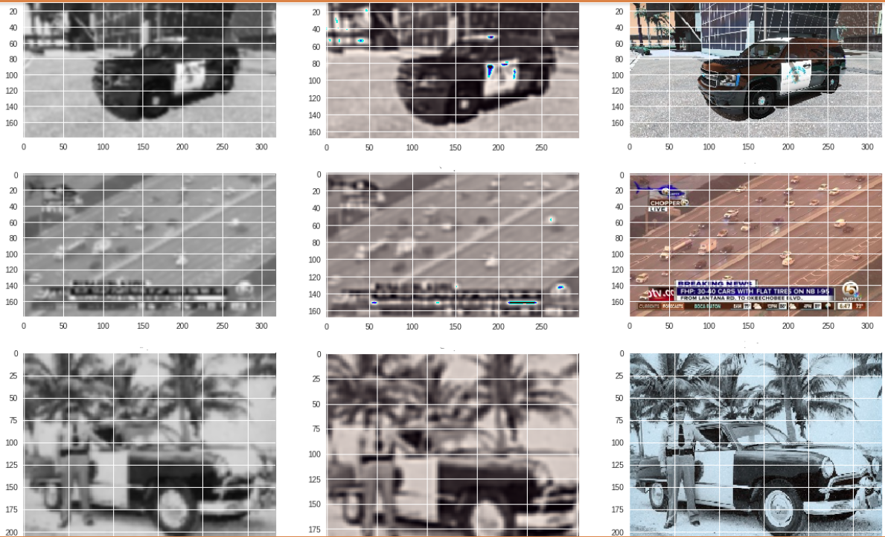

# Project: Can you unscramble a blurry image? 


### [Full Project Description](doc/project3_desc.md)

Term: Fall 2018

+ Team # Group 2
+ Team members
	+ team member 1 Yang Cai, yc3404
	+ team member 2 Yang Chen,yc3335
	+ team member 3 Yiming Shi,ys3050
	+ team member 4 Kehui Zhu,kz2293
	+ team member 5 Siyu Zhu,sz2716

+ Project summary: 
	+ In this project, we will carry out model evaluation and selection for predictive analytics on image data. Here we evaluate different modeling/analysis strategies and decide what is the best. And the decisions are supported by sound evidence in the form of model assessment, validation and comparison. Here, PSNR is the key factor we look into. 
	+ In addition, we also need to communicate our decision and supporting evidence clearly and convincingly in an accessible fashion. We were given a training set of 3000 images to realize a super resolution algorithm (half LR and half HR). 
	+ Our proposed model is using XXXXXXXX on color (RGB) features. The model leads to XX percent error rate, with a running time of XX seconds. We also try different method such as XXXX, however they have XX error rate and running time XX seconds and perform not very well. 
	+ Additionally, we use deep convolution nerual network to evulate the prediction analysis and have around PSNR 50 and conume time 45 minutes, but it did not predict the dimension and we will not use that model here.


 The following charts give an exhaustive visual understanding of the performance of all the models we used using the different features we extracted.

	
**Contribution statement**: ([default](doc/a_note_on_contributions.md)) All team members contributed equally in all stages of this project. All team members approve our work presented in this GitHub repository including this contributions statement. 


+

+ **Yang Chen**: Built baseline model(GBM). Eveulate model with SR-CNN tensorflow. Updated the Summary section in the Readme file of the project. Prepare for this project from the group.

+

+

+


References used:
1.  https://rpubs.com/mharris/multiclass_xgboost : Perform XGBoost
2.  http://www.milanor.net/blog/cross-validation-for-predictive-analytics-using-r/ :  CV error
3.  https://cran.r-project.org/web/packages/gbm/gbm.pdf; https://github.com/TZstatsADS/Fall2017-project3-grp3:  Perform GBM
4.  https://github.com/tegg89/SRCNN-Tensorflow :  SRCNN


Following [suggestions](http://nicercode.github.io/blog/2013-04-05-projects/) by [RICH FITZJOHN](http://nicercode.github.io/about/#Team) (@richfitz). This folder is orgarnized as follows.

```
proj/
├── lib/
├── data/
├── doc/
├── figs/
└── output/
```

Please see each subfolder for a README file.
